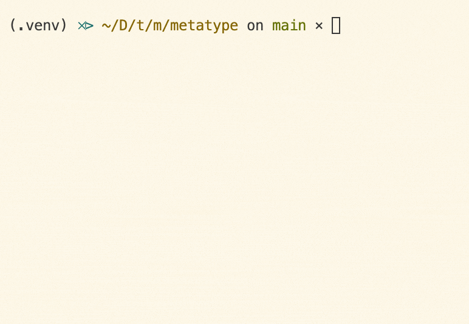

# Whiz


Whiz (/wɪz/) is a modern DAG/tasks runner for multi-platform monorepos. It
provides convenient live reloading, env management, pipes, and more in a tabbed
view.



> Whiz is part of the
> [Metatype ecosystem](https://github.com/metatypedev/metatype). Consider
> checking out how this component integrates with the whole ecosystem and browse
> the
> [documentation](https://metatype.dev?utm_source=github&utm_medium=readme&utm_campaign=whiz)
> to see more examples.

## Getting started

You can download the binary executable from
[releases page](https://github.com/zifeo/whiz/releases/) on GitHub, make it
executable and add it to your `$PATH` or use the method below to automate those
steps.

```bash
curl -fsSL https://raw.githubusercontent.com/zifeo/whiz/main/installer.sh | bash

# via cargo
cargo install whiz --locked 
cargo install --git https://github.com/zifeo/whiz --locked

# create your tasks file, see https://github.com/zifeo/whiz/blob/main/whiz.yaml for an example
touch whiz.yaml

# run
whiz

# upgrade
whiz upgrade
```

## Usage

### Configuration file

Environment variables for all tasks can be defined in the `env` section at root
level. You can use [Lade loaders](https://github.com/zifeo/lade) when loading
secrets (e.g. `infisical://DOMAIN/PROJECT_NAME/ENV_NAME/SECRET_NAME`).

```
env:
    [key]: [value]
```

All other root level keys are considered as tasks. Each time a dependency is
load, the dependent task is also reloaded.

```yaml
[task]:
    workdir: [working directory, by default .]
    command: [command]
    watch: [file or list of files]
    env:
        [key]: [value]
    env_file: [file or list of env files]
    depends_on: [task or list of task names for dependencies]
    pipes: # see https://github.com/zifeo/whiz/blob/main/whiz.yaml
        [regex]: [destination]
```

See this [file](https://github.com/zifeo/whiz/blob/main/whiz.yaml) for a
complete example.

### CLI options

See `whiz --help` for more information.

| Flags               | Description                                       |
| ------------------- | ------------------------------------------------- |
| -f, --file \<FILE\> | Specify the config file                           |
| -h, --help          | Print help information                            |
| --list-jobs         | List all the available jobs                       |
| -r, --run \<JOB\>   | Run specific jobs                                 |
| -t, --timestamp     | Enable timestamps in logging                      |
| -v, --verbose       | Enable verbose mode                               |
| -V, --version       | Print whiz version                                |
| -V, --version       | Print whiz version                                |
| --watch             | Globally enable/disable fs watching               |
| --exit-after        | Exit whiz after all tasks are done. Useful for CI | 


### Key bindings

| Keys         | Action                              |
| ------------ | ----------------------------------- |
| l, RighArrow | go to next tab                      |
| h, LeftArrow | go to previous tab                  |
| k, Ctl + p   | scroll up one line                  |
| j, Ctl + n   | scroll down one line                |
| Ctl + u      | scroll up half page                 |
| Ctl + d      | scroll down half page               |
| Ctl + b      | scroll up full page                 |
| Ctl + f      | scroll down full page               |
| 0            | go to last tab                      |
| 1-9          | go to the tab at the given position |
| q, Ctl + c   | exit the program                    |
| r            | rerun the job in the current tab    |

## Development

```bash
cargo run --
```
